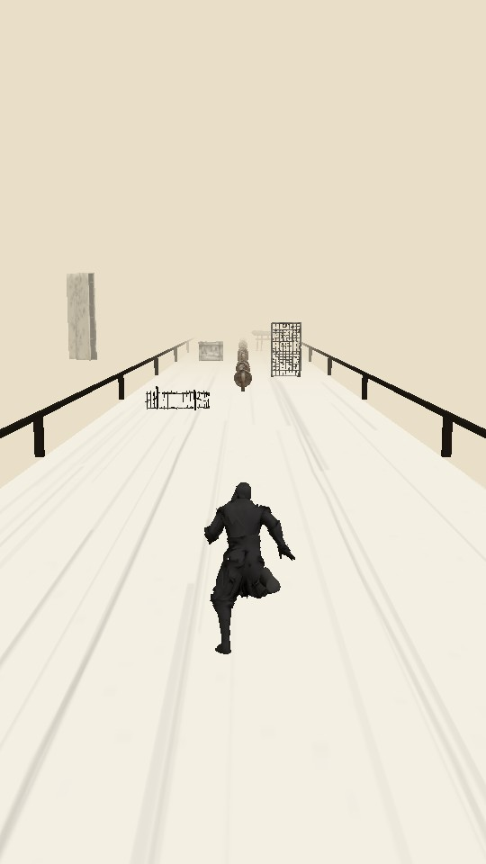
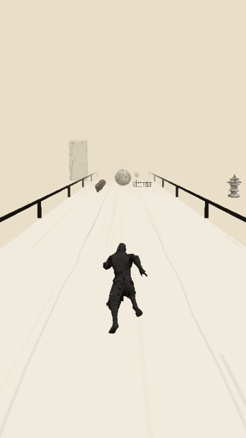
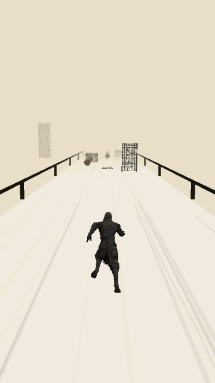
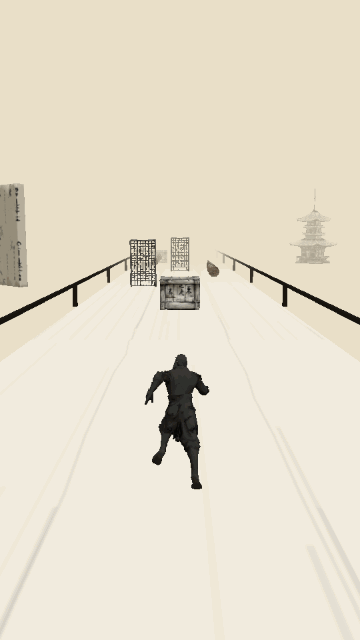

# 墨ランナー 🖌️

**和紙の上を駆ける、墨絵の世界のエンドレスランナー**

江戸の橋を舞台に、墨で描かれた侍の少年がどこまでも走る。銭を集め、障害物を躱し、巻物を手にすれば黒竜が空へ連れて行ってくれる —— Subway Surfers / Temple Run スタイルの3Dランナーを、水墨画×和紙の美術で仕上げたAndroid向けスマホゲームです。



## スクリーンショット & プレイ映像

| 走る・跳ぶ・滑る | 巻物 → 黒竜で空へ | 力尽きるまで |
|:---:|:---:|:---:|
|  |  |  |
| ジャンプと低い姿勢の<br>スライディングで障害物を回避 | 信仰の飛躍ポーズ+墨のオーラを纏い<br>竜に乗って滑空する必殺演出 | 被弾するとノックダウン。<br>倒れきってから「力尽きた」 |

## 特徴

- 🖌️ **墨絵×和紙の世界観** — 和紙色の空、筆のかすれが残る路面、墨のシルエットで描かれる竹林・石灯籠・五重塔
- 🏃 **3レーン走行アクション** — スワイプで移動/ジャンプ/スライディング、壁は登って乗り越える
- 🐉 **黒竜ライド** — 巻物を取ると信仰の飛躍モーションで黒竜に騎乗。墨のオーラを纏って空中の銭を回収、降り立てば1.5秒の無敵
- 🪨 **多彩な障害物** — 漢字の刻印が入った木箱、こちらへ転がってくる岩球、くぐる鳥居、跳び越える竹柵
- 🎭 **モーション演出** — Meshyのリギング/アニメーションAPIで生成した走り・ジャンプ・滑空・ノックダウンをシームレスにクロスフェード
- ⚡ **モバイル最適化** — 全アセット合計約7MB(元187MBから96%削減)、メッシュプーリング+シェーダー事前コンパイルでカクつきゼロを目指した設計

## 操作方法

| 操作 | アクション |
|---|---|
| ← / → スワイプ | レーン移動 |
| ↑ スワイプ | ジャンプ(壁の前なら登る) |
| ↓ スワイプ | スライディング(空中なら急降下) |
| 巻物を取る | 黒竜に騎乗して滑空 |

キーボード(開発用): 矢印キー / WASD / Space

## 遊び方(開発環境)

```bash
npm install
cp .env.example .env   # Meshy APIキーを設定(アセット再生成する場合のみ)
npm run dev            # http://localhost:5173
```

## アセットパイプライン

3Dアセットはすべて [Meshy AI](https://www.meshy.ai/) で生成しています。

```bash
npm run assets              # 全アセットをtext-to-3Dで生成(既存はスキップ)
npm run assets -- coin      # 指定アセットのみ再生成
node scripts/rig-runner.mjs # キャラをRemesh→リギング→走り/歩きアニメ付きGLB化
npm run compress            # テクスチャ512px WebP化+ポリゴン簡略化+量子化
```

- 生成した元データは `assets_raw/` に退避され、`public/models/` には圧縮版が置かれます
- 主人公 `hero.glb` は Meshy のアニメーションライブラリから Running / Jump_Run / Leap_of_Faith / Knock_Down などを結合したもの

## 技術スタック

| 領域 | 採用技術 |
|---|---|
| レンダリング | [Three.js](https://threejs.org/) (WebGL) |
| ビルド | [Vite](https://vitejs.dev/) |
| 3Dアセット生成 | Meshy AI (text-to-3D / Remesh / Rigging / Animation API) |
| アセット最適化 | [glTF-Transform](https://gltf-transform.dev/) (WebP・quantize・simplify) |
| GIF録画(開発用) | gifenc |

### パフォーマンス設計

- 障害物・銭はプールで使い回し、実行中の`clone()`とGCヒッチを排除
- ロード時に全マテリアルのシェーダーを事前コンパイル(初出現時のスパイク防止)
- 描画は等倍解像度固定、モデルは1体あたり500〜6,000三角形に簡略化
- 路面テクスチャ(和紙+筆かすれ)はCanvasで手続き生成

## ロードマップ

- [ ] 効果音・和楽器BGM
- [ ] スコア/ハイスコアの永続化
- [ ] 銭で買える強化要素(お守り・招き猫など)
- [ ] Capacitor で Android APK 化 → Google Play リリース

## ライセンス

個人開発プロジェクト(未定)

---

*墨と和紙、竜と銭。日本の美で走るランナー。*
